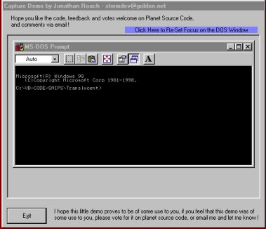

## Command\-Prompt Captured \!

### Description

This code captures an entire DOS-Prompt window into a picture box control on your form, allowing the command prompt to be a part of your project.

This code can be altered to give this functionality to virtually any external program.

Note: This code is being re-posted, as I have now got a new account with PSC and I have yet to upload all of my code again.
 
### More Info
 

             |
---                |---
**Submitted On**   |2000-07-15 23:09:48
**By**             |[Jonathan Roach](https://github.com/Planet-Source-Code/PSCIndex/blob/master/ByAuthor/jonathan-roach.md)
**Level**          |Intermediate
**User Rating**    |5.0 (15 globes from 3 users)
**Compatibility**  |VB 5\.0, VB 6\.0
**Category**       |[Miscellaneous](https://github.com/Planet-Source-Code/PSCIndex/blob/master/ByCategory/miscellaneous__1-1.md)
**World**          |[Visual Basic](https://github.com/Planet-Source-Code/PSCIndex/blob/master/ByWorld/visual-basic.md)
**Archive File**   |[Command\-Pr181664102001\.zip](https://github.com/Planet-Source-Code/jonathan-roach-command-prompt-captured__1-22270/archive/master.zip)

